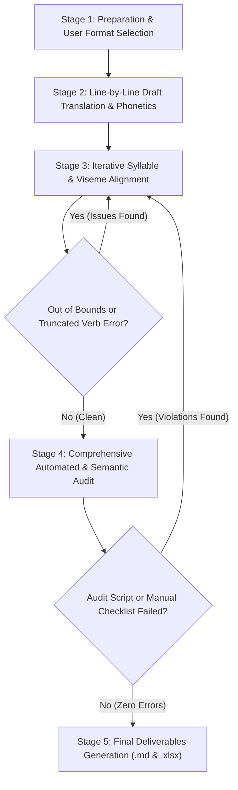

# English-to-Turkish Dubbing & Lip-Sync Translation Workflow

This skill defines the step-by-step engineering methodology for translating film scripts and dialogues from English to Turkish for dubbing (lip-sync). Follow this guide **strictly in sequential order from Stage 1 to Stage 5**.

---

## Sequential 5-Stage Workflow



---

### STAGE 1: Preparation & User Format Preference

Before initiating translation, determine the output format preference and analyze the English source script.

#### Step 1.1: Prompt User for Character Tag Format
Before generating or formatting dialogue text, **YOU MUST EXPLICITLY ASK THE USER** which character tag format they prefer:
- **Format Option 1 (With Brackets):** `[CHARACTER NAME]\t[PHONETIC TURKISH DIALOGUE]`
  *(Example: `[MELANIE]\tBir avukat tutabiliyor muyum?`)*
- **Format Option 2 (Without Brackets):** `CHARACTER NAME\t- [PHONETIC TURKISH DIALOGUE]`
  *(Example: `MELANIE\t- Bir avukat tutabiliyor muyum?`)*

> [!IMPORTANT]
> Do NOT place a trailing colon (`:`) after the character name inside or outside brackets. Use a single tab character (`\t`) between the character name and the dialogue text.

#### Step 1.2: Source Script Line Analysis
- Identify sentence boundaries, character turns, and dramatic pauses/interruptions (`...` or `--`).
- Determine whether a sentence is intentionally left incomplete in the source script or is a complete grammatical sentence.

---

### STAGE 2: Line-by-Line Draft Translation & Phonetic Integration

For each dialogue line sequentially (A, B, C...), perform the following steps:

#### Step 2.1: Calculate English Syllable Count ($N_{en}$)
Determine spoken phoneme syllables in English using `count_syllables_en`:
$$\text{Example: } \text{"Williams was arrested on suspicion of murder."} \rightarrow N_{en} = 13$$

#### Step 2.2: Draft Initial Natural Turkish Translation
- Draft a natural Turkish translation that preserves 100% of the character's emotion, intent, tone, and plot points.

#### Step 2.3: Apply Phonetic Transcription to Proper Nouns
**MANDATORY RULE:** Convert all foreign proper nouns, person names, place names, brand names, and technical terms into Turkish phonetic spelling using `english-to-turkish-phonetic-transcription`:
- *Williams* $\rightarrow$ *Vilyıms*
- *Melanie* $\rightarrow$ *Melani*
- *Jericho* $\rightarrow$ *Ceriko*
- *Chryse* $\rightarrow$ *Kraysi*

#### Step 2.4: Translate Professional Titles & Occupational Terms (NEVER Transliterate!)
**STRICT RULE:** Professional titles, occupational designations, military ranks, and honorifics are NOT proper nouns and **MUST BE TRANSLATED** into authentic Turkish terms:
- *Nurse* $\rightarrow$ **Hemşire** (NEVER write `"Nörs"`)
- *Doctor* $\rightarrow$ **Doktor** (NEVER write `"Doktır"`)
- *Sister* $\rightarrow$ **Rahibe** (NEVER write `"Sıstır"`)
- *Sergeant* $\rightarrow$ **Çavuş** (NEVER write `"Sarjınt"`)
- *Officer* $\rightarrow$ **Memur** / **Polis** (NEVER write `"Ofısır"`)

#### Step 2.5: Align Viseme Mouth Shapes & Breath Boundaries
- **Onset:** If the English line starts with rounded lips (/w/, /o/, /u/, /b/, /p/, /m/), start the Turkish sentence with a rounded vowel (O, Ö, U, Ü) or a bilabial consonant (B, P, M).
- **Offset:** If the character's mouth closes at the end of the line, end the Turkish line with a closed vowel or bilabial consonant.

---

### STAGE 3: Iterative Syllable & Viseme Refinement

#### Step 3.1: Calculate Turkish Phonetic Syllable Count ($N_{tr}$)
Because Turkish is 100% phonetic, count the vowels in the phonetically transcribed Turkish text:
```python
def count_syllables_tr(text: str) -> int:
    vowels = "aeıioöuüAEIİOÖUÜ"
    return sum(1 for char in text if char in vowels)
```

#### Step 3.2: Verify Syllable Limits & Prohibited Techniques
Target condition: $|N_{tr} - N_{en}| \le \text{tolerance}$ (strictly $\pm 10\%$ or max $\pm 1-2$ syllables).

> [!CAUTION]
> **STRICTLY PROHIBITED TECHNIQUES (NEVER DO THESE):**
> 1. **No Artificial Verb Chopping:** NEVER chop off or omit a trailing verb/predicate from a complete English sentence solely to fit syllable counts. (e.g., `"Senden harika bir polis"` $\rightarrow$ WRONG! Correct: `"Senden harika bir polis olur."`)
> 2. **No Artificial Tag Appending / Word Stuffing:** NEVER append candidate filler tags (`"polisler"`, `"yani"`, `"adamım"`) to artificially pad line lengths.
> 3. **No Context Fabrication / Semantic Hallucination:** NEVER invent plot details, cashiers, or stolen money not present in the original English dialogue solely to hit syllable numbers.

#### Step 3.3: Iterative Re-Translation Using Natural Vocabulary
- **If $N_{tr} > N_{en} + \text{tolerance}$ (Too Long):** Simplify verbose clauses or select concise natural Turkish verbs (without chopping the predicate).
- **If $N_{tr} < N_{en} - \text{tolerance}$ (Too Short):** Enhance phrasing using genuine Turkish vocabulary and sentence structures (without using artificial fillers or tag appending).

---

### STAGE 4: Comprehensive Automated & Semantic Audit Protocol

Once all lines are translated, execute the mandatory **AUDIT & CONTROL PROTOCOL**.

#### Step 4.1: Execute Automated Python Audit Script
Run the automated audit script located in `scripts/count_and_audit.py`:
```bash
python3 skills/dubbing-translator-guide-english-to-turkish/scripts/count_and_audit.py <english_source.md> <turkish_dubbing.md>
```

#### Step 4.2: Execute Agent 6-Item Manual Audit Checklist
In addition to running the Python script, the agent MUST perform a cognitive audit verifying these 6 rules across every line:

| # | Audit Check | Verification Standard | Action Required If Failed |
| :---: | :--- | :--- | :--- |
| **1** | **Syllable Tolerance Check** | $\|N_{tr} - N_{en}\| \le \text{tolerance}$ ($\pm 10\%$). | Return line to Stage 3 and rephrase using organic Turkish vocabulary. |
| **2** | **Sentence Completeness & Verb Check** | Complete English sentences MUST be translated as complete Turkish sentences with full predicates. | Restore the missing verb/predicate and adjust syllables elsewhere in the sentence. |
| **3** | **Artificial Filler & Tag Appending Check** | NO ungrounded tag words (`"polisler"`, `"yani"`, `"adamım"`), repetitive fillers, or unnecessary pronouns (`"ben"`, `"sen"`). Any word appended to pad length that lacks source context (listed or unlisted) is PROHIBITED. | Remove artificial tags and clean up redundant pronouns to ensure natural spoken flow. |
| **4** | **Punctuation & Interruption Sync** | Interrupted/trailing off lines MUST end in `...`. Complete sentences must end with appropriate punctuation (`.`, `!`, `?`). | Fix missing or incorrect punctuation to match acting performance. |
| **5** | **Proper Noun vs Title Check** | Personal/place names must be phonetically transcribed (*Vilyıms*); professional titles must be translated (*Hemşire*, *Doktor*). | Replace transliterated titles like `"Nörs"` or `"Sıstır"` with genuine Turkish words. |
| **6** | **Semantic Fidelity & Hallucination Check** | The translation must accurately reflect the original English plot, events, and context without fabricated stories. | Correct any context drift or hallucinated narrative details. |

---

### STAGE 5: Final Deliverables Generation

Only after achieving **zero errors** across all audit checks, generate the final deliverable files:

#### 1. Final Dubbing Markdown File (`.md`)
Clean Markdown script formatted strictly according to the user's selected format option (`[NAME]\tDIALOGUE` or `NAME\tDIALOGUE`).

#### 2. Comparative Verification Excel Workbook (`.xlsx`)
Run `scripts/generate_excel_audit.py` to create the 5-column formatted Excel workbook:
```bash
python3 skills/dubbing-translator-guide-english-to-turkish/scripts/generate_excel_audit.py <english_source.md> <turkish_dubbing.md> <output_audit.xlsx>
```

**Excel Column Architecture:**
- **Column A**: English Source Dialogue
- **Column B**: English Syllable Count ($N_{en}$)
- **Column C**: Phonetic Turkish Dubbing Translation
- **Column D**: Turkish Syllable Count ($N_{tr}$)
- **Column E**: Absolute Difference ($|N_{tr} - N_{en}|$)

---

## Case Studies: Good vs. Bad Translation Examples

| English Source Line | Target Syllables | Incorrect Translation (Reason) | Correct Translation ($N_{tr}$, Phonetic & Viseme Sync) |
| :--- | :---: | :--- | :--- |
| **“Williams was arrested on suspicion of murdering six rail workers...”** (56 syllables) | 56 | *“Vilyıms kuryelerin parasıyla tam burada yakalandı. Kasiyer paranın çalıntı olduğunu anlayıp hemen tutuklattı...”*<br>❌ **(Context Hallucination / Fabricated Story!)** | *“Vilyıms altı demiryolcu ve kuryeyi öldürme şüphesiyle Key-Tri-O-Fayv'da tutuklandı. Cesetler asılıp kafaları kesilmişti, tıpkı tesistekiler gibi.”* (54 syllables)<br>✅ **(100% Faithful & Natural Spoken Flow)** |
| **“Sounds nasty. But you seem to be holding together all right.”** (16 syllables) | 16 | *“Korkunç gibi. Ama iyi dayanmışsın polisler.”*<br>❌ **(Artificial Tag Stuffing - "polisler"!)** | *“Korkunç bir şey. Ama sen iyi dayanmışsın yine de.”* (16 syllables)<br>✅ **(100% Organic Turkish Phrasing)** |
| **“They’d make a hell of a cop.”** (7 syllables) | 7 | *“Senden harika bir polis”*<br>❌ **(Truncated Sentence / Chopped Verb!)** | *“Senden harika bir polis olur.”* (8 syllables)<br>✅ **(Grammatically Complete Sentence)** |
| **“Nurse Ballard is waiting for Doctor Whitlock.”** (13 syllables) | 13 | *“Nörs Balırd, Doktır Vitlok'u bekliyor.”*<br>❌ **(Transliterated Professional Titles!)** | *“Hemşire Balırd, Doktor Vitlok'u bekliyor.”* (13 syllables)<br>✅ **(Title Translated, Proper Names Phonetic)** |

---

## Summary Checklist

- [ ] Prompted user for character tag format preference (`[NAME]\tDIALOGUE` vs `NAME\t- DIALOGUE`)?
- [ ] Converted foreign proper nouns to Turkish phonetic spelling (*Williams* $\rightarrow$ *Vilyıms*)?
- [ ] Translated professional titles into authentic Turkish (*Nurse* $\rightarrow$ *Hemşire*)?
- [ ] Maintained grammatically complete sentences with unchopped verbs for complete English inputs?
- [ ] Avoided artificial tag appending (`"polisler"`, `"yani"`) and code-driven padding loops?
- [ ] Verified line integrity using `python3 scripts/count_and_audit.py` with 0 errors?
- [ ] Generated 5-column comparative Excel sheet using `generate_excel_audit.py`?

## Agent Orchestration & Concurrency Workflow

When an AI Agent is tasked with translating a long script (e.g., more than 200 lines), it must orchestrate the workload by dividing the source file and delegating chunks to parallel subagents. Follow this workflow:

### 1. File Splitting
The main agent must first count the lines in the source file and split it into smaller files of a maximum of 200 lines each. 

### 2. Subagent Definition
The main agent must define a `DubbingTranslator` subagent configuration for the translation tasks:

```json
{
  "name": "DubbingTranslator",
  "description": "Translates english lines to turkish for lip sync dubbing.",
  "hidden": true,
  "config": {
    "customAgent": {
      "systemPromptSections": [
        {
          "title": "Agent System Instructions",
          "content": "You are a specialized dubbing translator. Your task is to translate the given English dialogue lines into Turkish following the dubbing-translator-guide-english-to-turkish skill guidelines.\nImportant instructions:\n- Read the SKILL.md before you start.\n- The user has stated that there are NO character names in the source, so DO NOT output character names, just output the translated lines one by one.\n- You must ONLY use your own intelligence. Do NOT search for or try to use external APIs for translation or syllable counting.\n- Pay attention to phonetics (e.g. proper nouns to Turkish spelling) and matching syllable counts (+- 10%). For example, write foreign names phonetically (e.g. Williams -> Vilyıms). Do NOT forget this!\n- You will be given an input file. Read it, translate it line by line keeping the same order, and write the translated lines to the specified output file. Do NOT skip any lines. \n- Ensure you have exactly the same number of lines in your output file as in the input file.\n- Make sure to review your work against the 6-item manual audit checklist in the SKILL.md.\n- DO NOT run the audit Python scripts yourself. The parent agent will run them. Just produce the translated markdown file and send a message back when done."
        }
      ],
      "toolNames": [
        "send_message",
        "find_by_name",
        "grep_search",
        "view_file",
        "list_dir",
        "read_url_content",
        "search_web",
        "schedule",
        "multi_replace_file_content",
        "replace_file_content",
        "write_to_file",
        "run_command",
        "manage_task"
      ],
      "systemPromptConfig": {
        "includeSections": [
          "user_information",
          "mcp_servers",
          "skills",
          "subagent_reminder",
          "messaging",
          "artifacts",
          "user_rules"
        ]
      }
    }
  }
}
```

### 3. Task Delegation
Invoke a subagent for each split part and send them the following prompt format:

> Read {the part the main agent split for specified subagent}. Translate all lines to Turkish following the instructions in your system prompt. Write the final translated lines to {the file path where the main agent wants specified subagent to output the final MD file}. Send me a message when you are done.

### 4. Recombination & Audit
Wait for all subagents to signal completion. Concatenate the output files in the correct order to reconstruct the full translated script. Finally, execute the automated Python audit script and generate the Excel verification workbook as outlined in Stage 4 & Stage 5. Clean up the temporary split files.
